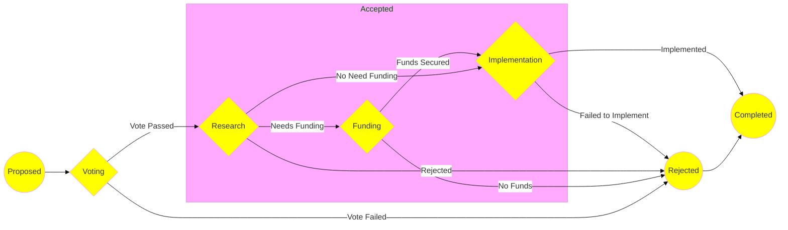

```mermaid
%%{init:{
  "theme": "base",

  "themeVariables": {
      "primaryBorderColor":"#f9e",
      "mainBkg": "yellow",
      "tertiaryColor": "#faf",
      "secondaryColor": "white"
      }
}}%%

graph LR
    P((Proposed))
    V{Voting}
    R{Research}
    F{Funding}
    I{Implementation}
    C((Completed))
    X((Rejected))

    P --> V
    V -->|Vote Passed| R
    subgraph Accepted
    R -->|Needs Funding| F
    F -->|Funds Secured| I
    end
    I -->|Failed to Implement| X
    I -->|Implemented| C
    R -->|Rejected| X
    F -->|No Funds| X
    R -->|No Need Funding| I
    V -->|Vote Failed| X
    X --> C

```